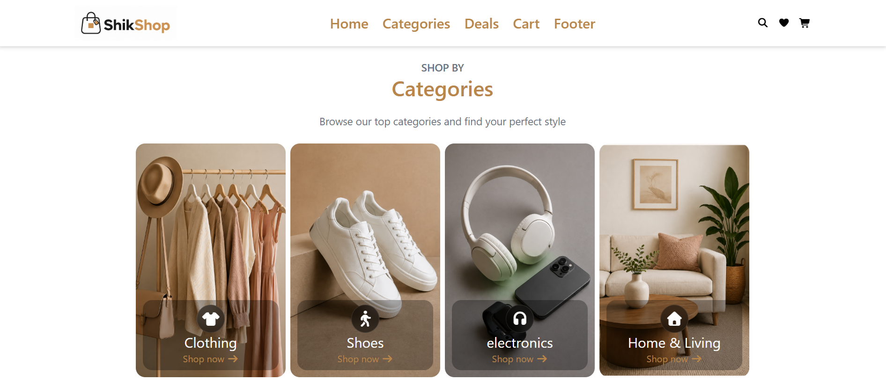

# ShikShop
A modern and responsive e-commerce web application built with **React**, **Vite**, and **Tailwind CSS**. ShikShop provides a clean and intuitive shopping experience for fashion, electronics, and home products.

---

## Features

- Modern and responsive UI
- Product browsing by categories
- Featured products, top sellers, and special offers
- Shopping cart with Add to Cart functionality
- Client-side routing with React Router
- Mobile-friendly navigation

## Planned Features
* Product Search
* User authentication (Sign Up & Login)

---

## Preview

### Home Page



---

## Tech Stack

* React
* Vite
* Tailwind CSS
* JavaScript (ES6+)
* HTML5
* CSS3
* React Router
* Context API

---

## Project Structure

```text
React-Ecommerce-App/
│
├── public/
├── src/
│   ├── assets/
│   ├── components/
│   ├── data/
│   ├── App.jsx
|   ├── index.css
│   └── main.jsx
│
├── package.json
├── vite.config.js
└── README.md
```

---

## Installation


---

## Author

**Narges Haidari**

<!-- GitHub: https://github.com/my-username -->
